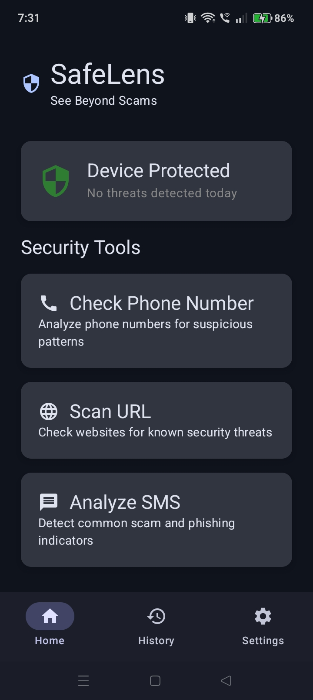
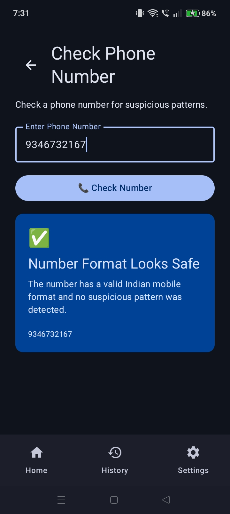
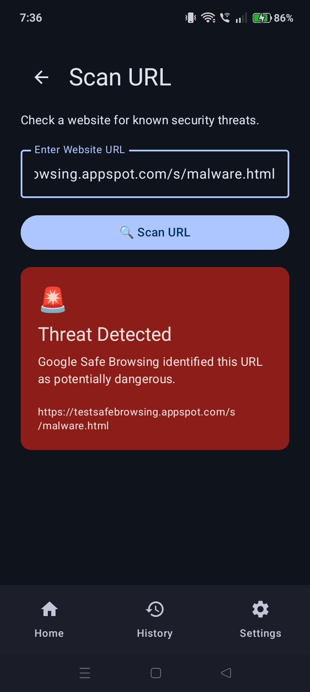
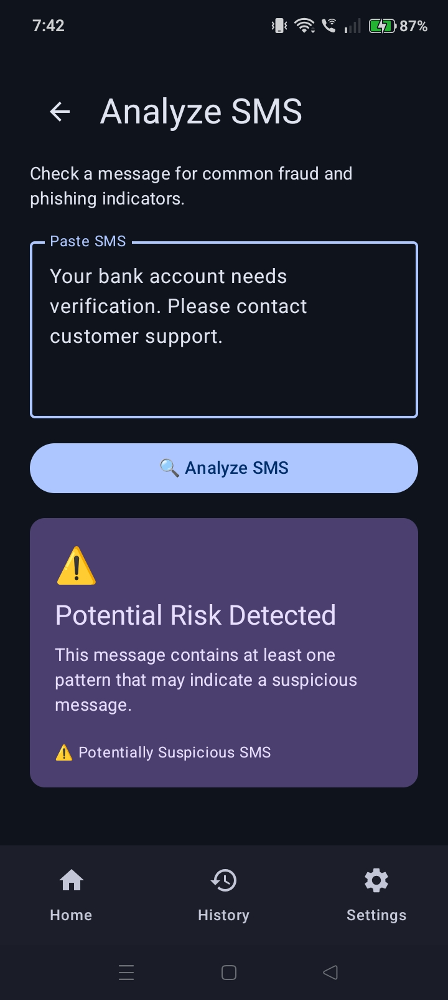
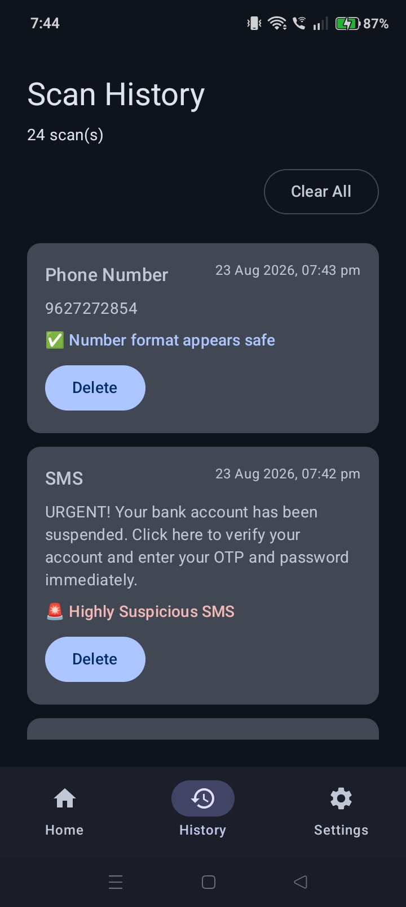

# 🛡️ SafeLens

### See Beyond Scams.

SafeLens is an Android fraud-detection application designed to help users identify potentially suspicious phone numbers, URLs, and SMS messages.

The app combines rule-based detection with Google Safe Browsing to provide quick and understandable security checks for potentially fraudulent digital content.

---

## ✨ Features

### 📞 Phone Number Scanner

- Validates Indian mobile numbers
- Detects known spam numbers
- Identifies suspicious repeated-number patterns
- Provides instant scan results
- Saves scan results to history

### 🌐 URL Scanner

- Checks URLs using Google Safe Browsing API
- Detects potentially dangerous websites
- Displays clear scan results
- Handles API and network errors
- Saves URL scans to history

### 💬 SMS Analyzer

- Analyzes SMS content for suspicious patterns
- Detects common scam and phishing keywords
- Identifies suspicious links
- Classifies messages as:
  - ✅ Safe
  - ⚠️ Potentially Suspicious
  - 🚨 Highly Suspicious
- Saves analysis results to history

### 📜 Scan History

- Stores previous scans locally
- Supports Phone, URL, and SMS scan history
- Delete individual scan records
- Clear complete scan history

### ⚙️ Settings

- Dark Mode
- Light Mode
- Clean and responsive interface

---

## 📱 Screenshots

### 🏠 Home

### 📞 Phone Number Scanner

### 🌐 URL Scanner

### 💬 SMS Analyzer

### 📜 Scan History

---

## 🛠️ Tech Stack

| Technology | Purpose |
|---|---|
| Kotlin | Primary programming language |
| Jetpack Compose | Modern Android UI |
| Material 3 | UI components and theming |
| Room Database | Local scan history |
| Retrofit | API communication |
| Google Safe Browsing API | URL threat detection |
| Kotlin Coroutines | Asynchronous operations |
| Gson | JSON parsing |
| KSP | Room code generation |
| Android Studio | Development |
| Git & GitHub | Version control |

---

## 🏗️ Architecture

SafeLens follows a simple layered architecture:

                    SafeLens
                       │
                       ▼
                Jetpack Compose
                       │
                       ▼
                   ViewModel
                       │
                       ▼
                   Repository
                    /       \
                   /         \
                  ▼           ▼
             Room Database   Retrofit
                               │
                               ▼
                    Google Safe Browsing

---

##🧪 Testing

SafeLens has been tested across its major features, including:

-Phone number validation
-Spam-number detection
-Suspicious number pattern detection
-URL scanning
-Google Safe Browsing threat detection
-SMS analysis
-Suspicious keyword detection
-Suspicious link detection
-Scan history
-Individual scan deletion
-Clearing scan history
-Dark/Light mode
-Navigation between screens
-Invalid input handling
-API/network error handling

---

##🔮 Future Improvements

-Real-time phone number reputation checking
-Machine-learning based SMS classification
-Advanced phishing detection
-URL reputation scoring
-More comprehensive threat intelligence
-Push notifications for detected threats
-Scan statistics and analytics
-Improved offline detection
-Backend-based API protection
-Multi-language support

---

##⚠️ Disclaimer

SafeLens is an educational and preventive security application.

A result marked Safe does not guarantee that a phone number, message, or website is completely safe.

Security detection systems can produce both false positives and false negatives. Users should independently verify suspicious messages, links, and requests.

---

##👩‍💻 Author

Krithi Prakash

Computer Science & Engineering Student

---

##📄 License

This project is created for educational and portfolio purposes.
